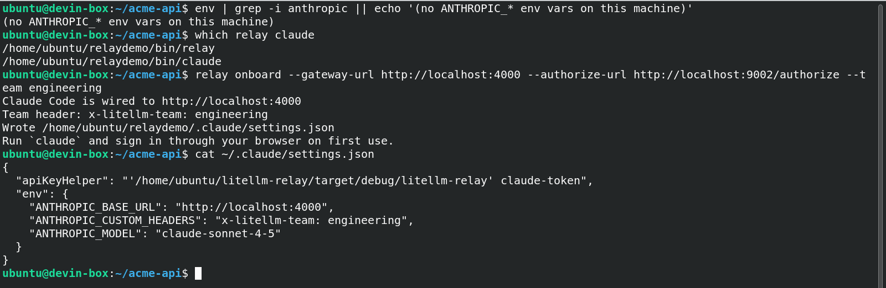
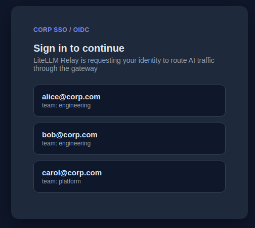
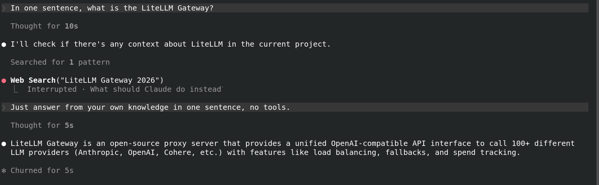
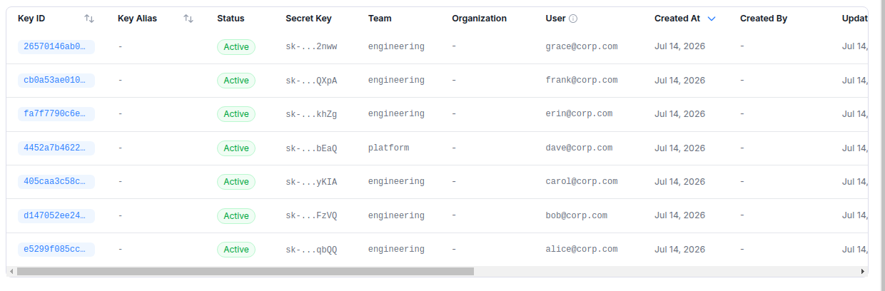

# LiteLLM Relay

LiteLLM Relay is a proxy you install on employee machines. It does two things.

First, it manages your AI coding tools. Relay installs and version-manages Claude Code and Codex across every laptop through your MDM, writes their settings, and lets developers sign in with their corporate identity through the LiteLLM AI Gateway, so nobody handles a provider API key.

Second, it captures shadow AI. Relay detects AI traffic from tools like Notion AI, Perplexity, and OpenClaw and routes it to the Gateway, making it a single pane of glass for all AI usage in your company.


# Usage 
 1. Install LiteLLM Relay on all your employee devices, using [supported MDM](https://github.com/LiteLLM-Labs/litellm-relay#supported-mdms)
 2. Employees use AI tools as they normally would, such as Notion AI.
    
 3. Every request, response, and usage event is captured in LiteLLM.
    

## Claude Code onboarding with IdP sign-in

Relay onboards Claude Code onto your LiteLLM AI Gateway with no manual setup. Employees never receive a provider API key and never export environment variables. Their existing corporate identity authenticates each request, and the Gateway maps that identity to a per-user virtual key with its own budget, model access, and spend tracking. Codex and other coding tools follow the same pattern and are coming next

This is the step-by-step guide for setting it up. See [docs/claude-code.md](docs/claude-code.md) for the full Gateway configuration and MDM detail

### Step 1: Enable JWT auth on the Gateway (admin, once)

Turn on JWT auth with `auto_register` so each SSO identity maps to its own virtual key and limits with no manual key handoff

```yaml
general_settings:
  enable_jwt_auth: True
  litellm_jwtauth:
    user_id_jwt_field: "sub"
    user_id_upsert: True
    team_id_jwt_field: "team_id"
    team_id_upsert: True
    virtual_key_claim_field: "email"
    unregistered_jwt_client_behavior: "auto_register"
```

### Step 2: Run `relay onboard` on the device

The MDM package (Jamf/Intune) installs Claude Code from your internal registry and Relay, then runs `relay onboard`. It writes `~/.claude/settings.json` pointing `ANTHROPIC_BASE_URL` at the Gateway, adds the team header, and wires an `apiKeyHelper` that supplies the identity token. Note there is no `ANTHROPIC_API_KEY` on the machine

```bash
relay onboard \
  --gateway-url https://gateway.yourco.com \
  --authorize-url https://login.yourco.com/authorize \
  --team engineering
```



### Step 3: Start Claude Code and sign in

The developer runs `claude` with no key and no exports. Relay opens the corporate IdP sign-in in the browser. A local mock IdP is shown here; in production this is your Okta, Entra, or Google tenant, set through `--authorize-url`



### Step 4: Use Claude Code through the Gateway

After sign-in, Relay hands Claude Code a short-lived bearer token and Claude Code answers through the Gateway, with no key on the device



### Step 5: Track spend in LiteLLM

The Gateway auto-registers a per-user virtual key from the SSO identity and tracks spend by user and team. Offboarding is removing the identity from the SSO group, after which its tokens stop validating



## Supported MDMs

Deploy LiteLLM Relay with your existing device-management process:

- Jamf
- Microsoft Intune
- Kandji
- Mosyle
- VMware Workspace ONE
- Addigy
- Custom shell scripts or internal deployment workflows

## Features

- Detect shadow AI usage across employee devices and company traffic sources
- Route AI traffic through LiteLLM AI Gateway for central visibility
- Log AI activity from desktop apps, browser AI, coding tools, agents, MCP
  clients, and LLM APIs
- Apply one set of Gateway controls for audit, access, provider routing, and
  policy

Relay does not log cookies or authorization headers. Payload previews are
truncated and headers are redacted.

## Install

Production deployments should pin the source tag and verify the source archive:

```bash
curl -fsSL https://raw.githubusercontent.com/LiteLLM-Labs/litellm-relay/main/src/install.sh | \
  RELAY_VERSION=v0.1.0 \
  RELAY_SHA256=<release-tarball-sha256> \
  bash
```

Then open a new terminal and run:

```bash
relay
```

For local development from a checked-out repository:

```bash
./src/install.sh --skip-trust-ca
```
