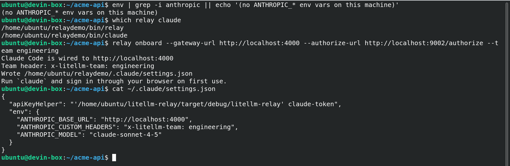
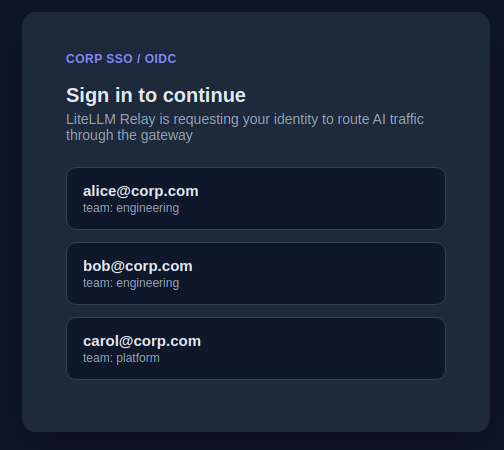
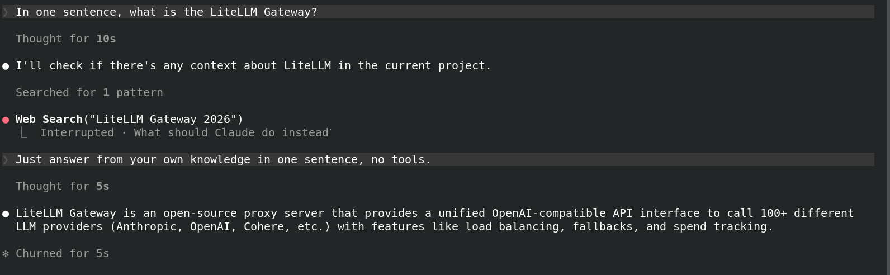
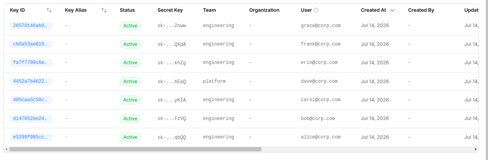

# Claude Code onboarding

Relay onboards Claude Code onto your LiteLLM AI Gateway with zero manual setup. Employees never receive a provider API key and never export environment variables. Their corporate identity authenticates each request, and the Gateway maps that identity to a per-user virtual key with its own budget, model access, and spend tracking.

## How it works

An admin enables JWT auth on the Gateway once, and from then on onboarding a device is a single `relay onboard` call. The MDM package (Jamf/Intune) installs Claude Code from your internal registry (the native build from `claude.ai/install.sh`, Homebrew, or an npm release from 2.1.120 on, which ships that binary; on macOS an older npm release that still runs `cli.js` under `node` is refused at onboard, since the Relay daemon only answers Anthropic-signed processes) alongside Relay, then runs `relay onboard`, which writes `~/.claude/settings.json` so Claude Code points at the Gateway and pulls its bearer token from Relay's token helper

When the developer runs `claude`, Relay signs them in through the corporate IdP on first use (OIDC authorization code with PKCE, so the app registration needs no client secret) and hands Claude Code the short-lived ID token. Relay keeps that session alive with the refresh token, so the browser opens once per device, not once per token lifetime. The Gateway validates the token, maps it to the developer's virtual key, enforces budget and limits, logs spend, and forwards upstream. No provider key ever touches the device, and offboarding is removing the identity from the SSO group, after which its tokens stop validating

## Usage

`relay onboard` writes the Claude Code settings pointing at the Gateway:



On first use Relay opens the corporate IdP sign-in in the browser (a local mock IdP is shown here; in production this is your org's OIDC tenant, Entra being the one this flow was verified against):



After sign-in, Claude Code answers through the Gateway with no key on the device:



The Gateway auto-registers a per-user virtual key from the SSO identity and tracks spend by user and team:



## Commands

`relay onboard` wires Claude Code to the Gateway and records the IdP issuer and client id, team, and model:

```bash
relay onboard \
  --gateway-url https://gateway.yourco.com \
  --oidc-issuer https://login.yourco.com \
  --oidc-client-id 00000000-0000-0000-0000-000000000000 \
  --team engineering \
  --model claude-sonnet-4-5
```

Relay reads `<issuer>/.well-known/openid-configuration` to find the authorization and token endpoints and requests `openid profile email offline_access` (trimmed to what the IdP advertises; pass `--oidc-scopes` to request an exact set, `openid` is always included). Relay refuses a discovery document whose `issuer` is not the configured one or whose endpoints are not https, so `--oidc-issuer` must be the tenant-specific issuer (for Entra `https://login.microsoftonline.com/<tenant id>/v2.0`, never `common` or `organizations`). The app registration is a public client: the redirect URI is `http://127.0.0.1/callback` (loopback, any port, or a fixed one with `--oidc-redirect-port`), it must issue ID tokens, and it needs no secret. In Entra that is the "Mobile and desktop applications" platform with "Allow public client flows" on; one registration serves Claude Code, Codex, and Claude Desktop, so keep every tool's redirect URI on it.

`relay claude-token` is what Claude Code's `apiKeyHelper` calls. It prints a Gateway credential for the configured team to stdout and nothing else; diagnostics go to stderr. Behind it, Relay reuses the cached ID token, renews it silently with the refresh token when it is within ten minutes of expiry (a failed renewal keeps serving the current token until a minute before it expires), and only opens the browser when there is no session to refresh. It then registers once with the Gateway's authorization server (`/.well-known/litellm-cli-auth`, then `/register`), exchanges the ID token for a Gateway credential at `/token` (the RFC 8693 token-exchange grant, with the team in the `x-litellm-team-id` header), and renews that credential with its refresh token ten minutes before it expires, without a new sign-in. When the Gateway refresh token has lapsed, Relay exchanges the ID token again, and when a renewal fails (the Gateway cannot be reached, or no sign-in is possible) it keeps serving the cached credential until that expires. The ID token and the Gateway refresh token are only ever posted to the Gateway URL Relay was onboarded with, whatever host the discovery document advertises, and those posts never follow a redirect. Concurrent calls from several tool processes take turns on one lock file per cache, so a single sign-in or renewal serves all of them instead of each process renewing on its own. A Gateway that has no authorization server, or whose authorization server does not offer the exchange because it maps IdP tokens to virtual keys, gets the ID token itself, as before, with a notice on stderr, and so does a run on which the Gateway could not issue a credential for any reason other than refusing the exchange (see [Gateway configuration](#gateway-configuration)).

## Generated settings

```json
{
  "apiKeyHelper": "relay claude-token",
  "env": {
    "ANTHROPIC_BASE_URL": "https://gateway.yourco.com",
    "ANTHROPIC_CUSTOM_HEADERS": "x-litellm-team: engineering",
    "ANTHROPIC_MODEL": "claude-sonnet-4-5"
  }
}
```

No provider API key is written to the device. The identity session (ID token plus refresh token) is cached under `~/.litellm-relay/identity-token.json` and the Gateway credential (one per Gateway and team, with its refresh token) under `~/.litellm-relay/gateway-credentials.json`, both with `0600` permissions on Unix.

On macOS `relay onboard` also registers the Gateway's MCP tools as the server `litellm` in `~/.claude.json` (`{"type":"stdio","command":"<relay>","args":["mcp"]}`, other servers kept) and allows its four tools, `mcp__litellm__search_tools`, `mcp__litellm__describe_tool`, `mcp__litellm__call_tool`, and `mcp__litellm__activate_server`, in `permissions.allow` of the user settings file above, so Claude Code's own per-tool prompt stays out of the way. `relay mcp` holds nothing: each call goes to the daemon over `~/.litellm-relay/mcp.sock`, which checks the caller and runs the tool with the signed-in user's credential. A tool the daemon cannot show to be read-only, and every server activation, shows a confirmation dialog in Claude Code before anything runs, and a headless `claude -p` answers that dialog with cancel. The verdict rules and the `mcp.allow` and `mcp.max_concurrent_calls` keys are in [mdm.md](mdm.md#mcp-relay).

## Gateway configuration

The Gateway validates the ID token Relay presents at `/token` against your IdP's JWKS through its JWT auth, resolves the developer and their team from it, and issues the Gateway credential the tools then send as their bearer. The exchange needs the Gateway's database, and the same JWT auth validates the ID token an older Relay sends directly:

```yaml
general_settings:
  enable_jwt_auth: True
  litellm_jwtauth:
    user_id_jwt_field: "sub"
    user_id_upsert: True
    fallback_to_db_teams: True
    # team_id_jwt_field: "team_id"  # only when your IdP puts a team_id claim in the ID token
    # team_id_upsert: True
```

The team the credential is issued for comes from one of two sources: a `team_id` claim in the ID token (`team_id_jwt_field`), or the developer's team membership on the Gateway under `fallback_to_db_teams: True` (add the developer to the team in the Admin UI or with `POST /team/member_add`). The tool's `--team` must name a team one of those sources grants the signed-in developer; otherwise the Gateway refuses the exchange and the tool fails with `the gateway refused the token exchange (HTTP 400 invalid_request: subject_token was rejected by the gateway's JWT auth); this tool is set to team ...`, where an older Relay's ID token was accepted with the team ignored. Add the developer to the team on the Gateway, or onboard the tool again with a team the Gateway accepts. A standard ID token carries no `team_id` claim, and the Gateway rejects every token that lacks a claim named in `team_id_jwt_field`, so leave the two `team_id_*` lines out unless your IdP is configured to issue that claim.

A Gateway that maps IdP tokens to virtual keys instead (`virtual_key_claim_field` with `unregistered_jwt_client_behavior: "auto_register"`) does not serve the exchange: its discovery document omits the grant and `/token` answers `400 unsupported_grant_type: this gateway maps IdP tokens to virtual keys, which the exchange does not serve`. Relay then sends the ID token itself as the bearer, as older Relay versions do, with a notice on stderr. Keep that mode if you rely on per-user virtual keys, and note that the claim it names has to be in the ID token (an Entra ID token carries no `email` claim for an account without a mail attribute, so the Gateway answers `403` for it).

`/.well-known/litellm-cli-auth`, `/register`, and `/token` are reached without a bearer, so a proxy or WAF in front of the Gateway should pass unauthenticated requests through to them. Relay treats only a `404` on the discovery path as a Gateway without an authorization server. When those paths are blocked (a `403`, a `503`, an HTML sign-in page) or the Gateway cannot be reached at all, `relay claude-token` and `relay codex-token` print the ID token itself with a notice on stderr, the bearer the older Relay sent, so a device with no cached credential keeps working wherever the Gateway's JWT auth accepts that token, and it gets a Gateway credential on the next run that reaches the authorization server. Only a refused exchange (the authorization server answered `/token` with a 4xx) and a failed sign-in stop the helpers, and `relay onboard-claude-desktop` never falls back to the ID token: it keeps the saved Gateway key or reports the failure.

```bash
JWT_PUBLIC_KEY_URL="https://login.yourco.com/.well-known/openid-configuration"
JWT_ISSUER="https://login.yourco.com"
JWT_AUDIENCE="00000000-0000-0000-0000-000000000000"
```

`JWT_AUDIENCE` is the client id of the app registration, since an ID token's `aud` is the client it was issued to.

## Production versus demo IdP

In production, `--oidc-issuer` and `--oidc-client-id` name your corporate IdP's OIDC issuer and a public app registration in it. Any OIDC provider that lets a public client complete authorization code plus PKCE and hands it a refresh token without a client secret fits; Entra is the provider this flow was verified against (issuer `https://login.microsoftonline.com/<tenant id>/v2.0`). Google's OAuth clients require a client secret at the token endpoint even for desktop apps, so Google does not fit this flow today. The screenshots in the README use a local mock IdP for demonstration only; it is not part of a deployment.

## MDM rollout

The MDM package installs Claude Code from your internal registry and runs `relay onboard` with your Gateway URL, IdP issuer and client id, and default team. Everything else follows the standard Relay rollout in [mdm.md](mdm.md): package the repo, deploy to the pilot scope, then broaden through Jamf or Intune. Because the settings file contains no provider key and the credential is obtained at runtime from the developer's IdP sign-in, the same package is safe to push fleet-wide.
