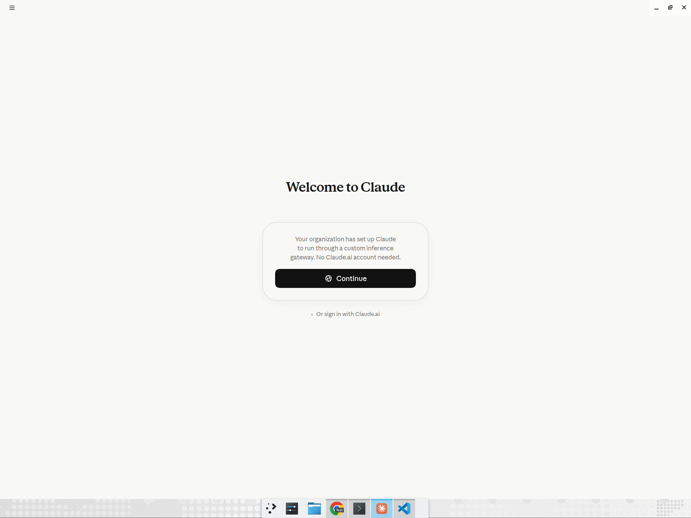
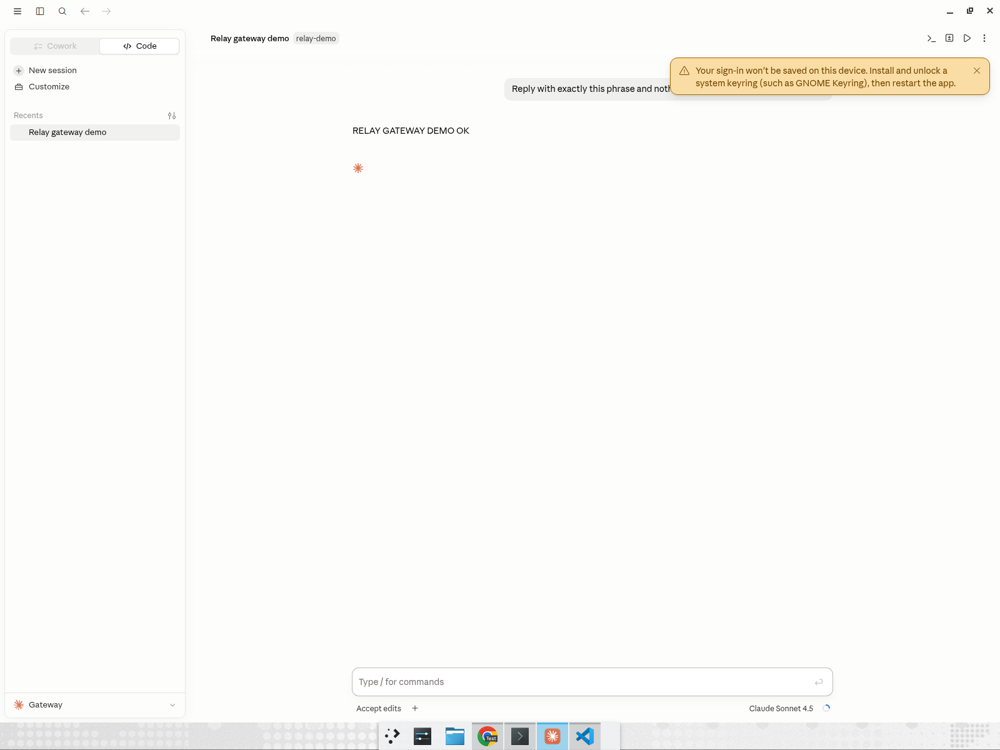

# Claude Desktop onboarding

Relay wires the Claude Desktop app (third-party gateway mode) onto your LiteLLM AI Gateway so it boots straight into gateway mode with no Claude.ai account and no key handling by the developer.

`relay onboard-claude-desktop` writes the OS-native managed configuration Claude Desktop reads on launch — `/etc/claude-desktop/managed-settings.json` on Linux — pointing inference at the Gateway. The Gateway must implement the Anthropic Messages API (`POST /v1/messages`), which LiteLLM does.

## Single sign-on (recommended)

Each developer signs in with their corporate account; the resulting OIDC token is sent to the Gateway as the bearer credential, so no provider or gateway key lands on the device.

```bash
sudo relay onboard-claude-desktop \
  --gateway-url https://gateway.yourco.com \
  --oidc-client-id "$CLIENT_ID" \
  --oidc-issuer https://login.yourco.com/v2.0
```

## Static key (proof of concept)

Distribute a shared Gateway key instead of SSO.

```bash
sudo relay onboard-claude-desktop \
  --gateway-url https://gateway.yourco.com \
  --api-key sk-your-gateway-key
```

The managed file must be root-owned (Claude Desktop ignores a user-writable one), so run the command with `sudo`. Restart Claude Desktop to pick up the configuration. Because the managed settings are OS-native, this is the surface you push through your MDM — see [mdm.md](mdm.md).

## Usage

The developer only launches Claude Desktop. It opens on the gateway welcome screen ("Your organization has set up Claude to run through a custom inference gateway. No Claude.ai account needed.") and answers through the Gateway.





## Demo

Claude Desktop and Codex, both onboarded by Relay and answering through one LiteLLM Gateway with zero developer setup:

[▶ Watch the demo (mp4)](video/claude-desktop-codex-vscode-gateway-demo.mp4)
