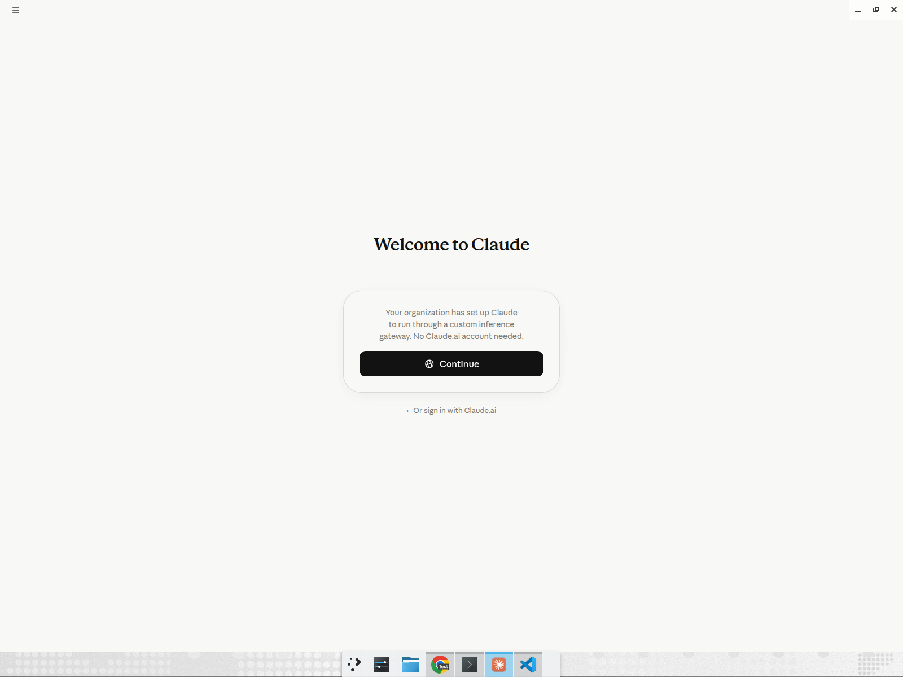
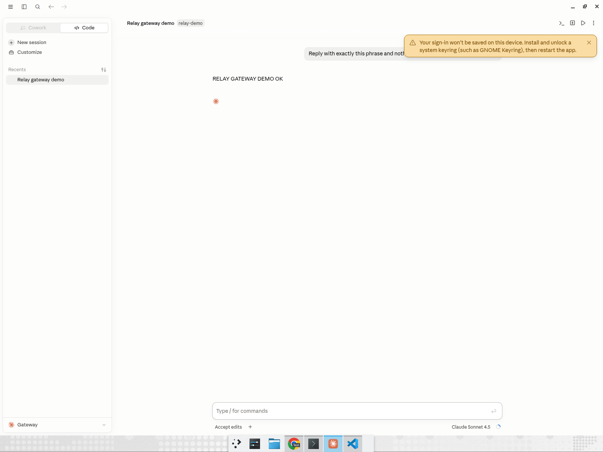

# Claude Desktop onboarding

Relay wires the Claude Desktop app (third-party gateway mode) onto your LiteLLM AI Gateway so it boots straight into gateway mode with no Claude.ai account and no key handling by the developer.

`relay onboard-claude-desktop` writes the OS-native managed configuration Claude Desktop reads on launch, pointing inference at the Gateway: on macOS the `com.anthropic.claudefordesktop` managed preferences domain (`/Library/Managed Preferences/com.anthropic.claudefordesktop.plist`), on Linux `/etc/claude-desktop/managed-settings.json`. The Gateway must implement the Anthropic Messages API (`POST /v1/messages`), which LiteLLM does.

## Single sign-on (recommended)

Each developer signs in with their corporate account; the resulting OIDC token is sent to the Gateway as the bearer credential, so no provider or gateway key lands on the device. Use the same public app registration Relay uses for [Claude Code](claude-code.md#commands) and Codex, and keep Relay's `http://127.0.0.1/callback` redirect URI on it next to the one Claude Desktop uses.

```bash
sudo relay onboard-claude-desktop \
  --gateway-url https://gateway.yourco.com \
  --oidc-client-id "$CLIENT_ID" \
  --oidc-issuer https://login.yourco.com/v2.0
```

## Relay-issued credential

On macOS, where the Relay daemon runs, the command writes no key at all: the managed file names `relay credential` as Claude Desktop's credential helper (`inferenceCredentialKind` `helper-script`), the app runs it when it needs a bearer, and the daemon answers over its Unix socket with the developer's IdP sign-in exchanged for a Gateway credential, or with the enrolled key, after checking that the asking process is the signed Claude Desktop app. The command also installs and starts the `ai.litellm.relay` LaunchAgent when no daemon is answering. The bearer lives in the daemon's memory and in the app's, never in the managed file, and the key is gone when the daemon stops. Everything below about an exchanged key written into the file applies to Linux, where there is no daemon.

When Relay is onboarded against an IdP (`relay onboard --oidc-issuer ... --oidc-client-id ...`), no credential flag is needed. Relay exchanges the developer's IdP sign-in for a Gateway credential at the Gateway's `/token` endpoint and writes it as the key Claude Desktop sends, so the Gateway attributes the app's traffic to the developer and their team without an admin-issued key.

```bash
sudo relay onboard-claude-desktop --gateway-url https://gateway.yourco.com --team platform
```

`--team` names the Gateway team the credential is issued for and is saved in Relay's config, in the same place `relay onboard --team` saves it, so leave it out on a device where Claude Code is already onboarded with a team. `relay autoconfigure --team` passes it to Claude Desktop too.

Run from a terminal, the command opens the browser sign-in when no identity token is cached. Without a terminal (an MDM push, the auto-configure daemon) it never opens a browser: it reuses the identity the developer already signed in with, so sign in once (`relay claude-token`, `relay codex-token`, or the command above) before its first run. The daemon renews the credential with its refresh token once less than half of its lifetime is left (12 hours into a 24-hour credential) and rewrites the managed file with the renewed one; a run that finds the credential still fresh makes no Gateway call and leaves the file alone, which matters because the root LaunchDaemon watches the directory it writes to and a rewrite on every run would re-trigger it within seconds. The key in the file keeps between half and all of its lifetime, less the hour between daemon runs. Claude Desktop reads the file on launch, so an app left running for longer than the credential's lifetime (24 hours by default) needs a restart to pick up the renewed one. When the exchange fails and a Gateway key is already saved in Relay's config, Relay keeps that key and reports the failure on stderr. `relay autoconfigure` first checks that saved key against the Gateway: when the Gateway rejects it or cannot be reached, the run says so, still exchanges the sign-in, and never writes the refused key, so an expired `relay setup` session no longer stops the daemon from renewing Claude Desktop's credential.

## Static key (proof of concept)

Distribute a shared Gateway key instead of a per-developer sign-in. An explicit `--api-key` wins over the Relay-issued credential.

```bash
sudo relay onboard-claude-desktop \
  --gateway-url https://gateway.yourco.com \
  --api-key sk-your-gateway-key
```

The managed location is root-owned and Claude Desktop ignores a user-writable copy, so run the command with `sudo`. Run it as the account that installed Relay and with plain `sudo`, not `sudo -H` or a different admin account: the saved Gateway key and SSO settings live in that account's `~/.litellm-relay/config.yaml`, which is the config the daemon loads, and a config saved under another home never reaches the daemon. Relay reads the file back after writing and fails instead of reporting success when Claude Desktop could not pick it up, including when a per-user managed plist (`/Library/Managed Preferences/<account>/com.anthropic.claudefordesktop.plist`, which the app reads over the host-level one) already sets the inference keys. On macOS it also deletes the `/etc/claude-desktop/managed-settings.json` that earlier Relay versions wrote there, a file the macOS app never reads. Restart Claude Desktop to pick up the managed configuration. On an MDM-enrolled Mac a managed-preferences refresh (login, a profile push) regenerates `/Library/Managed Preferences` from the installed profiles and drops the plist; the root LaunchDaemon `install.sh` registers (`ai.litellm.relay.autoconfigure-desktop`) watches that directory and writes the plist back within seconds, so keep it installed on a managed fleet. The OIDC settings from `onboard-claude-desktop --oidc-*` are saved in the Relay config, so the daemon's reruns keep single sign-on, and a later `onboard-claude-desktop --api-key` switches the device back to a static key, as does `relay autoconfigure --api-key`, while the daemon's `autoconfigure --only claude-desktop` runs without a key flag and keeps the saved single sign-on. That daemon owns the host-level plist as a whole document: a configuration profile that also manages `com.anthropic.claudefordesktop` at the computer level, even one that only adds a key such as `disableDeploymentModeChooser`, gets overwritten a few seconds after every refresh. Deliver extra keys through a user-scoped profile (`/Library/Managed Preferences/<account>/com.anthropic.claudefordesktop.plist`) that leaves the inference keys alone, and do not ship a computer-level profile for this domain alongside Relay. `uninstall.sh` removes the plist whenever it points at a gateway, including a profile-delivered one for another gateway, and leaves a plist for anything else alone. Because the managed settings are OS-native, this is the surface you push through your MDM, see [mdm.md](mdm.md).

A static key is stored in that file in clear, readable by every local account like any managed preference (the app reads it as the developer). Keep static keys to proofs of concept and use SSO for a rollout.

## Usage

The developer only launches Claude Desktop. It opens on the gateway welcome screen ("Your organization has set up Claude to run through a custom inference gateway. No Claude.ai account needed.") and answers through the Gateway.

That welcome screen also offers "Or sign in with Claude.ai", and the app remembers that choice: a developer who picked it once keeps booting on Claude.ai even though the managed configuration is in place, until they quit the app and delete the `deploymentMode` key from `~/Library/Application Support/Claude-3p/claude_desktop_config.json`, or a user-scoped MDM profile sets `disableDeploymentModeChooser` to true, which hides the option.





## Demo

Claude Desktop and Codex, both onboarded by Relay and answering through one LiteLLM Gateway with zero developer setup:

[▶ Watch the demo (mp4)](video/claude-desktop-codex-vscode-gateway-demo.mp4)
