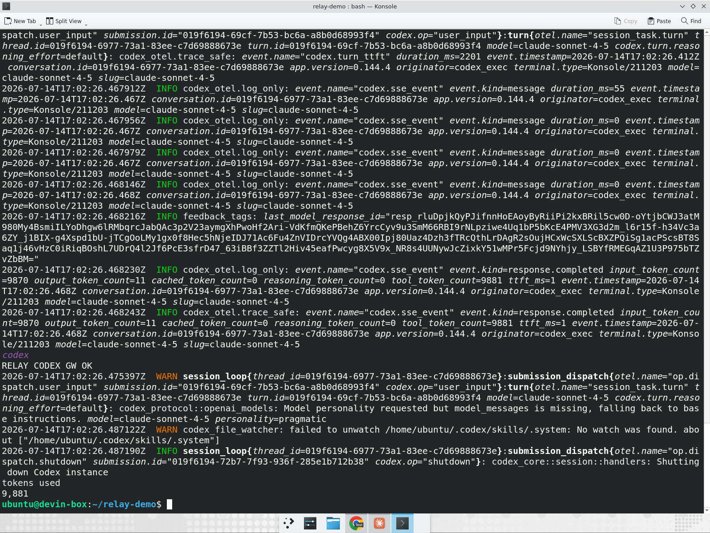

# Codex CLI onboarding

Relay onboards the OpenAI Codex CLI onto your LiteLLM AI Gateway the same way it onboards Claude Code: it writes Codex's own config so `codex` routes through the Gateway with the developer's corporate identity, and no provider API key touches the device.

Codex reads `~/.codex/config.toml`. Relay defines a custom OpenAI-compatible provider under `[model_providers.<id>]` (pointing `base_url` at the Gateway's `/v1`) and selects it with the top-level `model_provider`/`model` keys. For the credential it uses Codex's command-backed `auth` hook, which runs Relay's token command to fetch a short-lived identity bearer token on demand (Codex refreshes it on the `refresh_interval_ms` interval).

> **Gateway must serve the Responses API.** Codex only supports `wire_api = "responses"` (`wire_api = "chat"` is rejected by the CLI), so the provider talks to the Gateway's `POST /v1/responses`. LiteLLM supports the Responses API — make sure it is enabled for the models you expose.

## Step 1: Enable JWT auth on the Gateway (admin, once)

Same as [Claude Code](claude-code.md#gateway-configuration) — turn on JWT auth with `auto_register` so each SSO identity maps to its own virtual key and limits.

```yaml
general_settings:
  enable_jwt_auth: True
  litellm_jwtauth:
    user_id_jwt_field: "sub"
    user_id_upsert: True
    team_id_jwt_field: "team_id"
    team_id_upsert: True
    virtual_key_claim_field: "email"
    unregistered_jwt_client_behavior: "auto_register"
```

## Step 2: Run `relay onboard-codex` on the device

```bash
relay onboard-codex \
  --gateway-url https://gateway.yourco.com \
  --authorize-url https://login.yourco.com/authorize \
  --team engineering \
  --model gpt-5-codex
```

This writes `~/.codex/config.toml`:

```toml
model = "gpt-5-codex"
model_provider = "litellm"

[model_providers.litellm]
name = "LiteLLM AI Gateway"
base_url = "https://gateway.yourco.com/v1"
wire_api = "responses"
http_headers = { x-litellm-team = "engineering" }

[model_providers.litellm.auth]
command = "/usr/local/bin/litellm-relay"
args = ["codex-token"]
refresh_interval_ms = 300000
```

There is no API key in the file. `relay codex-token` prints a valid IdP bearer token on stdout, which is exactly what Codex's `auth` hook expects. The file is written with `0600` permissions.

## Step 3: Start Codex and sign in

The developer runs `codex` with no key and no exports. On first use Relay opens the corporate IdP sign-in in the browser, caches the identity token, and hands Codex a short-lived bearer token for each request. Spend is tracked per-user in LiteLLM, exactly as with Claude Code.

## Credential alternatives

The `auth` hook is the default and keeps no key on the device. Codex treats `auth`, `env_key`, and `experimental_bearer_token` as mutually exclusive, so Relay writes exactly one.

- `--env-key <VAR>`: Codex reads the bearer key from an environment variable (`env_key = "<VAR>"`) rather than invoking the hook. Populate it with the identity token from your shell profile:

  ```bash
  relay onboard-codex --gateway-url https://gateway.yourco.com --env-key LITELLM_API_KEY
  export LITELLM_API_KEY="$(relay codex-token)"
  ```

- `--api-key <KEY>`: for environments without an IdP, embeds a static gateway key as `experimental_bearer_token` on the provider.

  ```bash
  relay onboard-codex --gateway-url https://gateway.yourco.com --api-key sk-...
  ```

## Usage

The developer only runs `codex`. It answers through the Gateway — here it returns a deterministic phrase, and the request lands on the Gateway's Responses API:



## Demo

Claude Desktop and the Codex CLI, both onboarded by Relay and answering through one LiteLLM Gateway with zero developer setup:

[▶ Watch the demo (mp4)](video/claude-desktop-codex-cli-gateway-demo.mp4)
