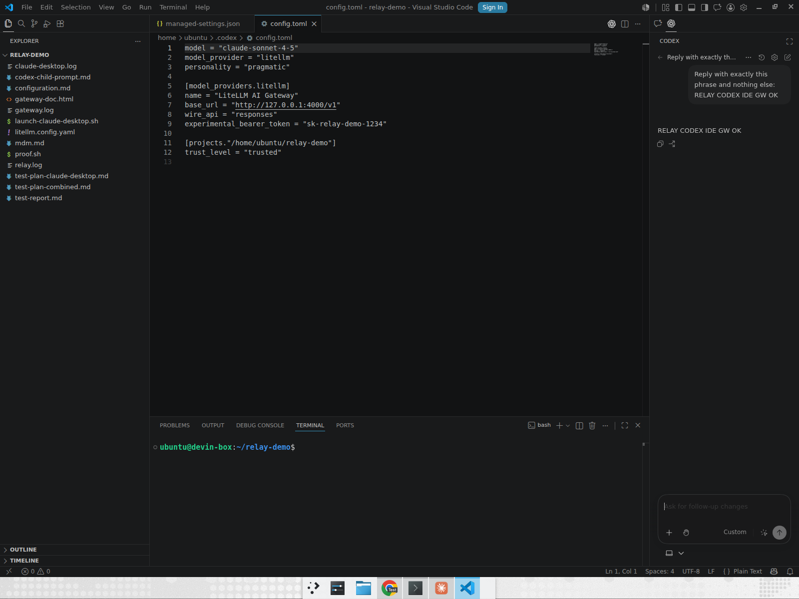

# Codex with VS Code onboarding

Relay onboards the OpenAI Codex extension for VS Code onto your LiteLLM AI Gateway with the exact same config it writes for the Codex CLI — the extension and the CLI share `~/.codex/config.toml`, so one `relay onboard-codex` call wires up both surfaces.

The developer never signs in to ChatGPT. The extension reads the custom OpenAI-compatible provider Relay defined (pointing `base_url` at the Gateway's `/v1`, `wire_api = "responses"`) and shows it as a "Custom" model, then routes every request through the Gateway.

## Step 1: Onboard Codex

Run `relay onboard-codex` exactly as for the [Codex CLI](codex-cli.md#step-2-run-relay-onboard-codex-on-the-device). This writes `~/.codex/config.toml` with the LiteLLM provider and the identity `auth` hook (or a static key / env key). The VS Code extension picks the same file up on launch — no extra configuration.

> **Gateway must serve the Responses API.** As with the CLI, Codex only supports `wire_api = "responses"`, so the extension talks to the Gateway's `POST /v1/responses`.

## Step 2: Install the Codex extension

Install the OpenAI Codex extension (`openai.chatgpt`) in VS Code — via your usual extension channel, or fleet-wide through your MDM / VS Code extension policy.

## Step 3: Use Codex in VS Code

The developer opens the Codex panel and sends a prompt. No ChatGPT sign-in is required; the model selector shows the relay-configured "Custom" provider, and the answer comes back through the Gateway.

## Demo

Claude Desktop and the Codex VS Code extension, both onboarded by Relay and answering through one LiteLLM Gateway with zero developer setup:

[▶ Watch the demo (mp4)](video/claude-desktop-codex-vscode-gateway-demo.mp4)

## Note: the hosted Codex web app is not routable

Only local Codex clients that read `~/.codex/config.toml` (the CLI and this VS Code extension) can be pointed at your Gateway. The hosted `chatgpt.com/codex` cloud agent runs on OpenAI's infrastructure against OpenAI's models with no client-side gateway configuration, so it cannot be routed through a self-hosted Gateway by Relay or any MDM.
