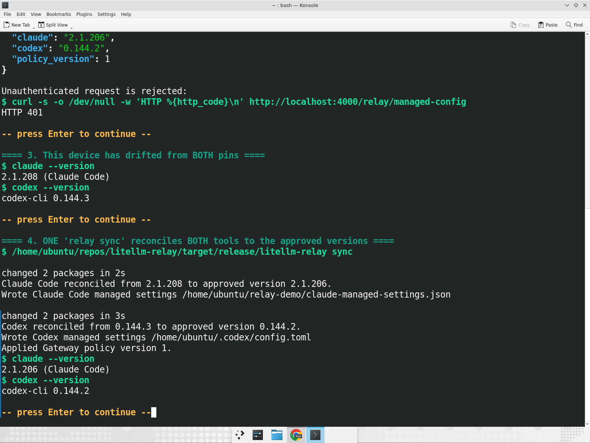
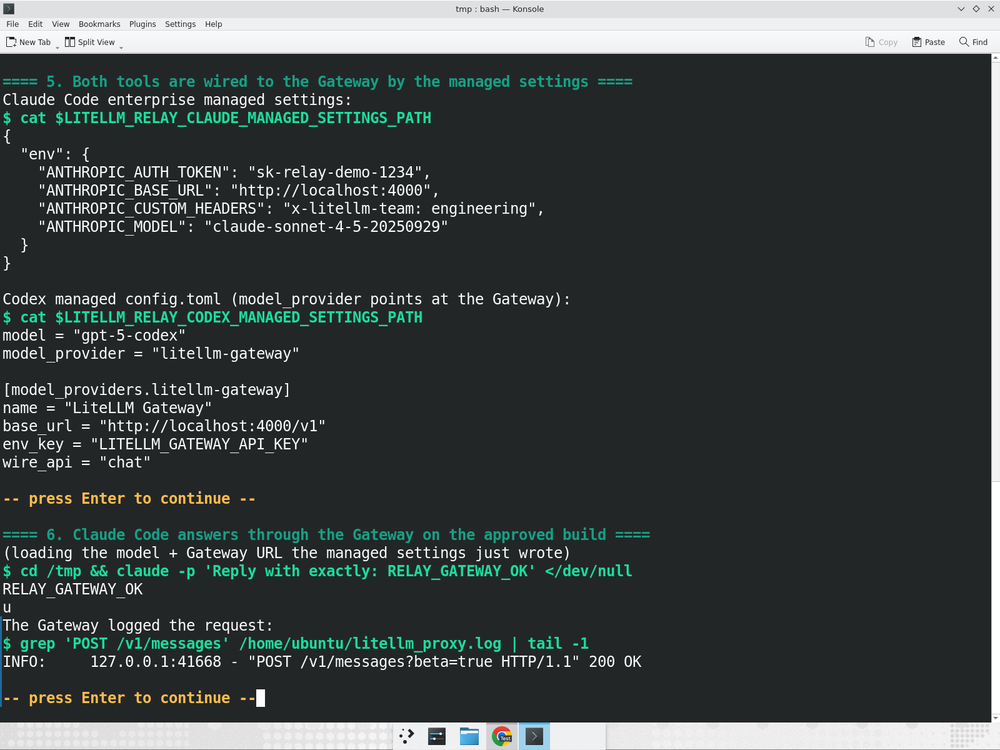
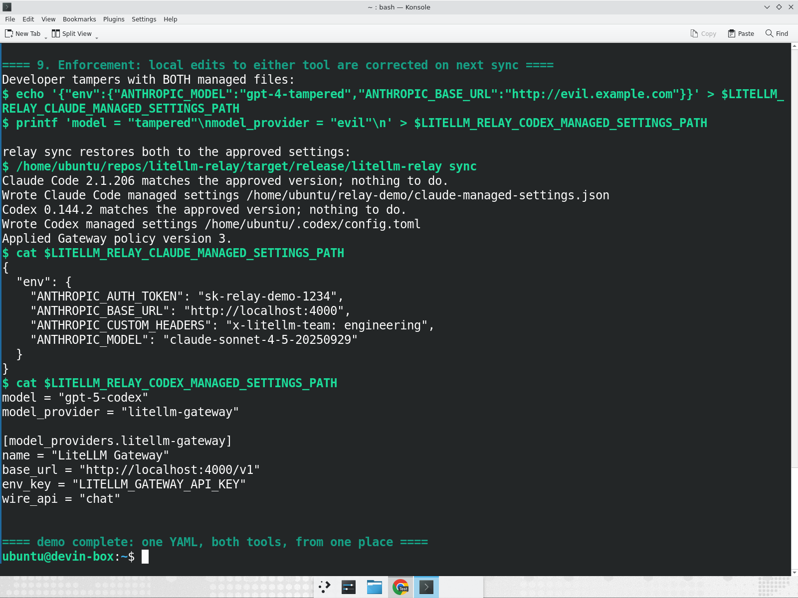

# Managing Claude Code and Codex versions

This is the admin runbook for pinning, upgrading, and rolling back the Claude
Code and Codex versions your fleet runs, from one file. It assumes Relay is
already deployed and the tools are onboarded onto the Gateway (see
[claude-code.md](claude-code.md)).

The model: you keep the approved versions in one small YAML file on the
Gateway, and every device converges on them the next time Relay syncs. You never
edit anything per device, and both tools are governed from the same place.

## How it fits together

```
admin edits relay_settings.yaml   (claude_code + codex in one file)
          |
          v
LiteLLM Gateway  GET /relay/managed-config   (reads the file per request, behind auth)
          |
          v
relay sync  ->  installs each pinned version + writes each tool's managed settings
          |
          v
developer runs `claude` / `codex`  ->  the approved builds, routed through the Gateway
```

The settings file is its own thing. It is not the proxy `config.yaml`, and
nothing about it touches your model list or proxy configuration.

## One-time Gateway setup

Point the Gateway at a settings file and start it as usual:

```bash
export LITELLM_RELAY_SETTINGS_PATH=/etc/litellm/relay_settings.yaml
litellm --config /etc/litellm/config.yaml
```

If `LITELLM_RELAY_SETTINGS_PATH` is unset, the Gateway looks for
`relay_settings.yaml` in its working directory. The file is re-read on every
request, so you never restart the Gateway to change a pin.

## The settings file

```yaml
# relay_settings.yaml  (NOT your proxy config.yaml)
claude_code:
  channel: pinned
  version: "2.1.206"                 # exact Claude Code version the fleet must run
  registry: npm
  package: "@anthropic-ai/claude-code"
  model: claude-sonnet-4-5           # folded into Claude Code managed settings
  managed_settings: {}               # optional extra managed-settings keys
codex:
  channel: pinned
  version: "0.144.2"                 # exact Codex version the fleet must run
  registry: npm
  package: "@openai/codex"
  model: gpt-5-codex                 # folded into the managed Codex config
policy_version: 7                    # bump on each change so devices see a new revision
updated_by: admin@yourco.com
updated_at: "2026-07-14T03:00:00Z"
```

Confirm the Gateway serves it (any enrolled key works; the request must be
authenticated):

```bash
curl -s https://gateway.yourco.com/relay/managed-config \
  -H "Authorization: Bearer <enrolled-key>" | jq '{claude: .claude_code.version, codex: .codex.version}'
# { "claude": "2.1.206", "codex": "0.144.2" }
```

## Rolling out to a device

On the device, Relay reconciles every managed tool with one command:

```bash
relay sync
```

`relay sync` fetches the policy, compares each pin to the installed
`claude --version` / `codex --version`, installs the exact pinned version when
they differ, and writes each tool's managed settings. It is idempotent: a device
already on the approved versions does no work.

```
$ relay sync
Claude Code reconciled from 2.1.208 to approved version 2.1.206.
Wrote Claude Code managed settings /etc/claude-code/managed-settings.json
Codex reconciled from 0.144.3 to approved version 0.144.2.
Wrote Codex managed settings /home/dev/.codex/config.toml
Applied Gateway policy version 7.
```

In production `relay sync` runs on the existing schedule (LaunchAgent), so you
do not run it by hand; editing the file is the whole workflow.

## Upgrading, downgrading, rolling back

All three are the same action: change a `version`, bump `policy_version`, and
let devices sync. It works the same for `claude_code` and `codex`.

1. Test the new version yourself
2. Set `version` for that tool in `relay_settings.yaml` and bump `policy_version`
3. Devices converge on their next sync
4. If it regresses, set `version` back to the previous value; devices roll back
   on their next sync

There is nothing version-specific about a rollback; pinning an older version is
just another edit.

## Enforcement

For Claude Code, Relay writes the model and Gateway wiring into Claude Code's
enterprise managed-settings file, which is the highest-precedence settings
layer. For Codex, Relay writes a managed `config.toml` whose `model_provider`
points at the Gateway. Because `relay sync` rewrites both files every run, a
developer who edits one locally is corrected on the next reconcile.

Managed-settings locations:

- Claude Code: `/etc/claude-code/managed-settings.json` on Linux,
  `/Library/Application Support/ClaudeCode/managed-settings.json` on macOS
- Codex: `~/.codex/config.toml` (override with
  `LITELLM_RELAY_CODEX_MANAGED_SETTINGS_PATH`)

## Failure behavior

- Missing settings file on the Gateway: an empty policy is returned and Relay
  leaves the device untouched
- Malformed settings file: the Gateway returns an error rather than a wrong
  policy, and `relay sync` reports it
- Install failure for one tool: the previously working install is left intact
  and the error is surfaced; the device retries on the next sync. A failure on
  one tool does not stop the other from reconciling on the following run

## v0 limitations

- Installs come from npm only; other registries are rejected rather than
  silently skipped
- Version pinning is best-effort at user scope; a signed policy and a privileged
  helper for stronger tamper-resistance are deferred
- The file is edited directly; there is no admin UI or API in v0

## Walkthrough

A full run of the loop below (pin, sync, answer through the Gateway, upgrade,
roll back, and enforcement) for both tools is captured in the demo recording
shared with the rollout.

### One file pins both tools; a device reconciles both



### Claude Code answers through the Gateway on the pinned build



### A local edit to managed settings is corrected on the next sync


